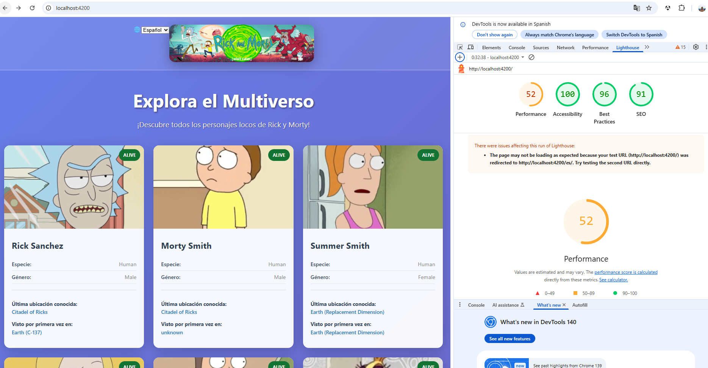

## Evidencias de mejora en Lighthouse


Se muestran a continuación los resultados de Lighthouse antes y después de aplicar las optimizaciones de imágenes, accesibilidad y i18n:

**Antes de las optimizaciones:**


**Después de las optimizaciones:**



Estas mejoras incluyen:
- Reducción del peso y tamaño de las imágenes.
- Uso de formatos modernos y responsive (`ngSrc`, `NgOptimizedImage`).
- Mejoras de contraste y estructura de encabezados para accesibilidad.
- Implementación de i18n estático y dinámico.

## Accesibilidad: Contraste de Color

Para asegurar la accesibilidad y aprobar las auditorías de Lighthouse, se mejoró el contraste de color para los indicadores de estado y los botones de paginación:

- `.status-indicator.status-alive` ahora usa un verde oscuro accesible (`#137333` con texto blanco).
- `.status-indicator.status-dead` usa rojo oscuro accesible (`#b00020` con texto blanco).
- `.status-indicator.status-unknown` usa gris oscuro accesible (`#616161` con texto blanco).
- Los botones de paginación usan azul accesible (`#0057b8` con texto blanco) y gris claro para deshabilitado.

**Ejemplo de CSS accesible:**

```css
.status-alive { background: #137333; color: #fff; }
.status-dead { background: #b00020; color: #fff; }
.status-unknown { background: #616161; color: #fff; }
.pagination-btn { background: #0057b8; color: #fff; }
.pagination-btn:disabled { background: #bdbdbd; color: #333; }
```

Esto mejora la legibilidad para todos los usuarios y cumple con los estándares de accesibilidad WCAG AA.

# AngularSofkau

Este proyecto fue generado con [Angular CLI](https://github.com/angular/angular-cli) versión 16.2.16.

## Servidor de desarrollo

Ejecuta `ng serve` para iniciar el servidor de desarrollo. Navega a `http://localhost:4200/`. La aplicación se recargará automáticamente si cambias alguno de los archivos fuente.

## Generación de código

Ejecuta `ng generate component nombre-componente` para generar un nuevo componente. También puedes usar `ng generate directive|pipe|service|class|guard|interface|enum|module`.

## Build

Ejecuta `ng build` para construir el proyecto. Los artefactos de la build se almacenarán en el directorio `dist/`.

## Pruebas unitarias


Ejecuta `ng test` para ejecutar las pruebas unitarias con [Karma](https://karma-runner.github.io).

### Pruebas unitarias de internacionalización (i18n)

Se añadieron pruebas automáticas para verificar la correcta visualización de textos en los tres idiomas soportados (inglés, español y francés) usando ngx-translate. Estas pruebas validan que:

- El título principal (`h1`), el subtítulo y el pie de página muestran el texto traducido correspondiente según el idioma seleccionado.
- El cambio de idioma en tiempo real actualiza los textos en pantalla sin recargar la aplicación.
- La detección automática del idioma del navegador funciona correctamente (por defecto inglés si no está soportado).

Estas pruebas aseguran que la experiencia multilingüe sea robusta y que la cobertura de i18n esté garantizada en futuras actualizaciones del código.

## Pruebas end-to-end

Ejecuta `ng e2e` para ejecutar las pruebas end-to-end. Para usar este comando, primero debes agregar un paquete que implemente capacidades de pruebas end-to-end.

## Optimización de Imágenes con NgOptimizedImage, ngSrc e Imágenes Responsivas

Este proyecto utiliza la directiva `NgOptimizedImage` de Angular y el atributo `ngSrc` para optimizar la carga y entrega de imágenes:

- Todas las etiquetas `` usan `[ngSrc]` en vez de `src` para mejor rendimiento y generación automática de `srcset`.
- Las imágenes se proveen en múltiples resoluciones y formatos modernos (WebP) siguiendo la convención de nombres: `imagename-320w.webp`, `imagename-640w.webp`, etc.
- El atributo `[ngSrc]` apunta a la versión más pequeña; Angular genera automáticamente el `srcset` para carga responsiva.
- El atributo `[priority]` se establece en `true` para imágenes críticas, mejorando LCP y tiempos de carga.
- El atributo `sizes` se configura para carga responsiva mobile-first.

**Ejemplo:**

```html

```

> **Nota:** Debes generar y colocar las diferentes resoluciones de imagen (WebP o AVIF) en la carpeta `assets/`. Angular las usará automáticamente para una entrega óptima.

## Internacionalización (i18n)

Este proyecto implementa dos estrategias para internacionalización:

### 1. i18n Estático (en build, Angular Localize)

- Usa el i18n integrado de Angular con archivos XLF (`src/locale/messages.en.xlf`, `messages.es.xlf`, `messages.fr.xlf`).
- La app puede ser construida para cada idioma usando Angular CLI y la opción `localize`.
- El idioma se selecciona en tiempo de build; cambiar de idioma requiere una nueva build y recarga.

**Build para todos los idiomas:**
```
ng build --localize
```

### 2. i18n Dinámico (en runtime, ngx-translate)

- Integra [ngx-translate](https://github.com/ngx-translate/core) para cambio de idioma en tiempo real.
- Los archivos de traducción están en `src/assets/i18n/en.json`, `es.json`, `fr.json`.
- La app detecta el idioma del navegador al cargar y lo establece automáticamente (por defecto inglés si no está soportado).
- Hay un selector de idioma en la UI que permite cambiar el idioma instantáneamente sin recargar la app.

**Ejemplo de uso en plantilla:**
```html
<h1>{{ 'title' | translate }}</h1>
<button (click)="onLangChange($event)">{{ 'try-again' | translate }}</button>
```

**How to add more languages:**
1. Add a new JSON file in `src/assets/i18n/` (e.g., `de.json`).
2. Add the language code to the supported languages in `app.component.ts` and the selector in the template.

---
For more details, see the code and comments in `app.module.ts`, `app.component.ts`, and the translation files.


